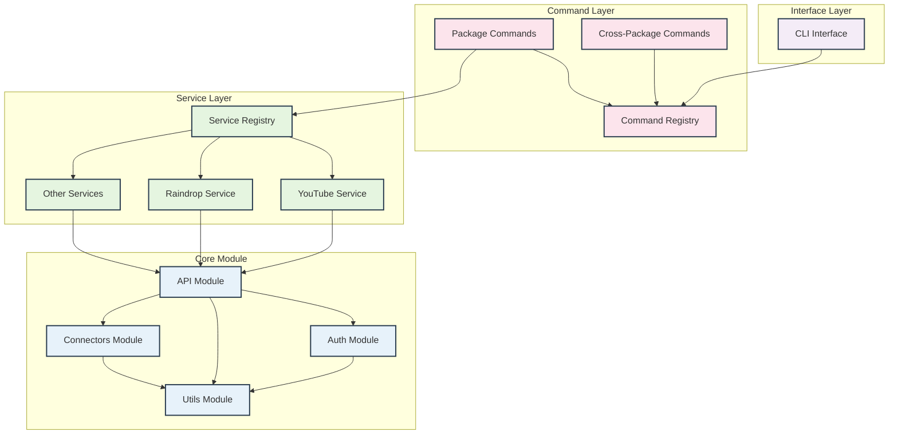

# <WIP> API Service Orchestrator (apiso)

## overview

status:

- broken due monorepo upgrade
- resolution eta: July 29, 2024

features:

- connect and CRUD to multiple services using personal secrets
- data manipulation utility libraries

### services

- [ ] claude
- [ ] clickup - next (supports oauth + api key)
- [ ] google
- [ ] github (starred repos)
- [ ] google
- [ ] google-drive
- [ ] google-fi
- [ ] google-fit
- [ ] instagram (saved bookmarks)
- [ ] linkedin
- [x] raindrop
- [ ] reddit (saved posts)
- [ ] samsung-health
- [x] youtube (saved playlists)

## App Arch

### design



### dir

```
/packages
  /cli - Implements the command-line interface, exposes commands module
  /commands - Defines and implements executable commands, contains dev script for quick use
  /core - Aggregates and re-exports foundational modules (API, Auth, Utils)
    /api - Provides base API functionality for making network requests
    /auth - Manages authentication strategies and token handling
    /connectors - Manages connector methods and tools
    /utils - Contains utility functions used across the project
  /services - Contains service-specific implementations (e.g., Raindrop, YouTube)
    /sample
    /raindrop
    /youtube
```

## TODO

- [ ] resolve breaking changes for each module
- [ ] jest
- [ ] standardize error handling
- [ ] readme for each service (setup + auth)
- [ ] resolve dependencies mis-alignment (`yarn explain peer-requirements`)
- [ ] generate new package/service script
- [ ] add clickup support (oauth and api key)
- [ ] add claude support (oauth and api key)
- [ ] youtube: bulk manage descriptions
- [ ] youtube: delete playlist
- [ ] migrate commands to 'command' package
- [ ] migrate auth logic to 'auth' package
- [ ] migrate utils logic to 'utils' package
- [x] dev dependencies: prettier, eslint, ts-node
- [x] yarn workspaces
- [x] yarn
- [x] re-structure packages
- [x] typescript
- [x] name
- [x] git init + github
- [x] [BUG] resolve server staying open after getPlaylists has returned result
- [x] get videos for each playlist
- [x] create raindrop for each playlist.item with playlist name and resources as tag
- [x] add raindrop to \_Resources collection
- [x] [BUG][GOOGLE] resolve refresh token
- [x] pagination
- [x] clean repo

## setup and config

- raindrop: add api-key to .env
- google: add client secret, client key to .env

## Background

### competitors

- [Zapier](https://zapier.com/)
- [MuleSoft](https://www.mulesoft.com/)
- [n8n](https://n8n.io/)


modules:

core = api + auth + utils

package = api(service)

commands + core(service-package)

cli --> commands
