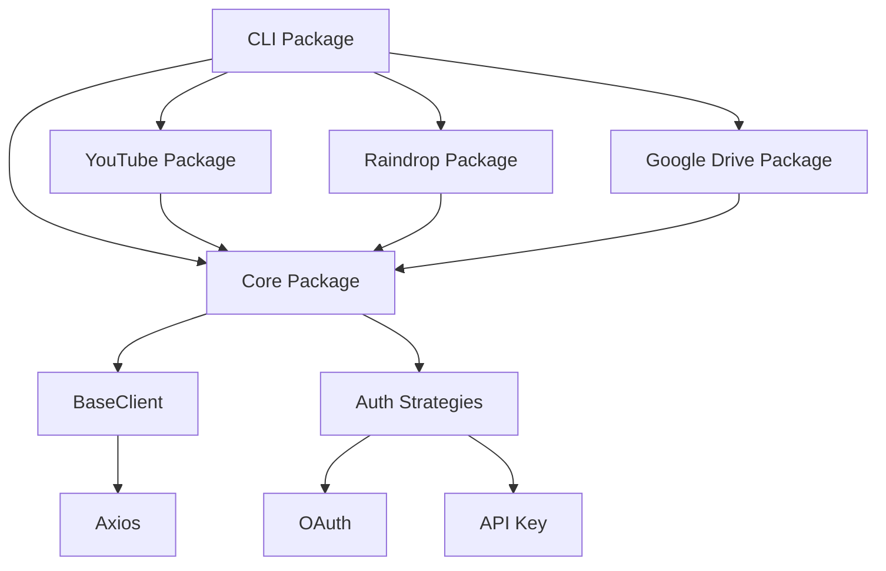

# <WIP> API Service Orchestrator (apiso)

## overview

status:

- broken due monorepo upgrade
- resolution eta: July 29, 2024

features:

- connect and CRUD to multiple services using personal secrets
- data manipulation utility libraries

### services

- [ ] claude
- [ ] clickup - next (supports oauth + api key)
- [ ] google
- [ ] github (starred repos)
- [ ] google
- [ ] google-drive
- [ ] google-fi
- [ ] google-fit
- [ ] instagram (saved bookmarks)
- [ ] linkedin
- [x] raindrop
- [ ] reddit (saved posts)
- [ ] samsung-health
- [x] youtube (saved playlists)

## App Arch

### design



### dir

```
@your-project/
├── packages/
│   ├── core/
│   │   ├── src/
│   │   │   ├── types.ts
│   │   │   ├── BaseClient.ts
│   │   │   ├── auth/
│   │   │   │   ├── AuthStrategy.ts
│   │   │   │   ├── OAuthStrategy.ts
│   │   │   │   └── ApiKeyStrategy.ts
│   │   │   ├── errors.ts
│   │   │   └── index.ts
│   │   ├── package.json
│   │   └── tsconfig.json
│   ├── youtube/
│   │   ├── src/
│   │   │   ├── YouTubeClient.ts
│   │   │   ├── types.ts
│   │   │   └── index.ts
│   │   ├── package.json
│   │   └── tsconfig.json
│   ├── raindrop/
│   │   ├── src/
│   │   │   ├── RaindropClient.ts
│   │   │   ├── types.ts
│   │   │   └── index.ts
│   │   ├── package.json
│   │   └── tsconfig.json
│   ├── google-drive/
│   │   ├── src/
│   │   │   ├── GoogleDriveClient.ts
│   │   │   ├── types.ts
│   │   │   └── index.ts
│   │   ├── package.json
│   │   └── tsconfig.json
│   └── cli/
│       ├── src/
│       │   ├── commands/
│       │   │   ├── youtube.ts
│       │   │   ├── raindrop.ts
│       │   │   └── googleDrive.ts
│       │   ├── index.ts
│       │   └── cli.ts
│       ├── package.json
│       └── tsconfig.json
├── tsconfig.json
├── package.json
├── lerna.json
└── README.md
```

## TODO

- [ ] resolve breaking changes for each module
- [ ] standardize error handling
- [ ] add clickup support (oauth and api key)
- [ ] add claude support (oauth and api key)
- [ ] jest
- [ ] readme for each service (setup + auth)
- [ ] generate new package/service script
- [ ] youtube: delete playlist
- [ ] youtube: manage descriptions in bulk
- [x] dev dependencies: prettier, eslint, ts-node
- [x] yarn workspaces
- [x] yarn
- [x] re-structure packages
- [x] typescript
- [x] name
- [x] git init + github
- [x] [BUG] resolve server staying open after getPlaylists has returned result
- [x] get videos for each playlist
- [x] create raindrop for each playlist.item with playlist name and resources as tag
- [x] add raindrop to \_Resources collection
- [x] [BUG][GOOGLE] resolve refresh token
- [x] pagination
- [x] clean repo

## setup and config

- raindrop: add api-key to .env
- google: add client secret, client key to .env

## Background

### competitors

- [Zapier](https://zapier.com/)
- [MuleSoft](https://www.mulesoft.com/)
- [n8n](https://n8n.io/)
